## flex布局
### flex布局概述？
&emsp;&emsp;flex是flexible Box的缩写，意为“弹性布局”，用来为盒模型提供最大的灵活性，设置为flex布局之后，子元素的**float、clear、vertical-align**属性将失效。
&emsp;&emsp;任何一个容器都可以指定为flex布局
```
#box1{
    display : flex;
    width:300px;
    height:100px;
}
```
其实，总体上来说，flex布局分为两类：父容器属性和子容器属性
### 一：父容器属性
&emsp;&emsp; 父容器属性用来控制子元素的显示方式，有6种：
1. flex-direction ：设置主轴(就是x轴)的方向，默认row，x轴从左到右；
2. flex-wrap ： 子元素换行方式，默认nowrap；
3. flex-fow ： flex-direction和flex-wrap的简写，默认row nowrap；
4. justify-content ： 子元素在主轴上的对齐方式，默认flex-start左对齐；
5. align-items ： 定义项目在交叉轴上如何对齐(就是y轴)
6. align-content ： 定义了多根轴线的对齐方式。

#### 1. flex-direction 属性
&emsp;&emsp;决定主轴(x轴)的方向，有四个属性：
- row（默认值）：主轴为水平方向，起点在左端。   
- row-reverse：主轴为水平方向，起点在右端。
- column：主轴为垂直方向，起点在上沿。
- column-reverse：主轴为垂直方向，起点在下沿。
用法：
```
    #container{
        display: flex;
        /* flex-direction: row | row-reverse | column | column-reverse; */
        width:300px;
        height:100px;
        border: 1px solid #000;
    }
    .inner{
        width:100px;
        background:orange;
        margin:10px;
    }
```
```
    <div id="container">
        <div class="inner">1</div>
        <div class="inner">2</div>
        <div class="inner">3</div>
    </div>
```
对应的样式：

#### 2.flex-wrap 属性
&emsp;&emsp;决定子元素(也称为项目)的换行方式
&emsp;&emsp;默认情况下，项目都排在一条线上（即nowrap；）上。flex-wrap属性定义，如果一条轴线排不下，就可以设置另起一行(wrap).
```
    #container{
        display: flex;
        /* flex-wrap: wrap | nowrap | wrap-reverse; */
        width:300px;
        height:100px;
        border: 1px solid #000;
    }
    .inner{
        width:100px;
        background:orange;
        margin:10px;
    }
```
默认：nowrap 不换行

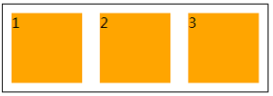

wrap ： 换行

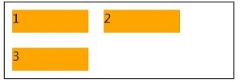

wrap-reverse ：换行，第二行在第一行上面，从左到右


### 3. flex-fow 属性
&emsp;&emsp;flex-direction和flex-wrap的简写，默认row

### 4. justify-content 属性
&emsp;&emsp;子元素在主轴上的对齐方式，默认flex-start左对齐；

- flex-start ： 默认，左对齐
- flex-end ： 右对齐
- center ： 居中对齐
- space-between ： 两端对齐，子元素(项目)之间间隔相等
- space-around ： 每个子元素两侧的间隔相等。所以，子元素之间的间隔比子元素与边框的间隔大一倍。
```
    #container{
        display: flex;
        /* justify-content: flex-start | flex-end | center | space-between | space-around; */
        justify-content: space-around;
        width:300px;
        height:100px;
        border: 1px solid #000;
    }
    .inner{
        width:60px;
        background:orange;
        border:1px solid #fff;
    }  
```
flex-start:

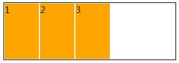

flex-end : 

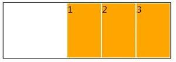

center : 

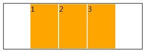

space-between : 


space-around ：

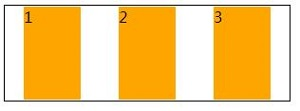

### 5. align-items 属性
&emsp;&emsp;定义子元素在交叉轴上如何对齐
- flex-start：交叉轴的起点对齐;
- flex-end：交叉轴的终点对齐;
- center：交叉轴的中点对齐;
- baseline: 项目的第一行文字的基线对齐,注意观察第一行文字的位置;
- stretch（默认值）：如果项目未设置高度或设为auto，将占满整个容器的高度.
```
    #container{
        display: flex;
        /* align-items: flex-start | flex-end | center | baseline | stretch; */
        align-items: stretch ;
        width:300px;
        height:250px;
        border: 1px solid #000;
    }
    .inner{
        width:60px;
        height:50px;
        background:orange;
        border:1px solid #fff;
    }
```
flex-start : 

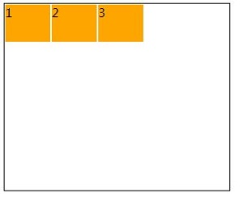

flex-end : 


center : 

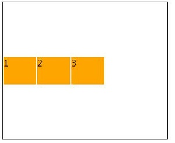


baseline : 注意，测试stretch的时候需要把div这样设置：
```
    <div id="container">
        <div class="inner" style="height:200px;line-height:200px;">1</div>
        <div class="inner">2</div>
        <div class="inner">3</div>
    </div>
```

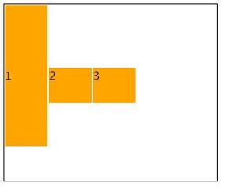

stretch：注意，测试stretch的时候需要去掉高度，然后看效果：

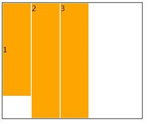

### 6. align-content 属性
&emsp;&emsp;属性定义了多根轴线的对齐方式。如果项目只有一根轴线，该属性不起作用.
- flex-start：与交叉轴的起点对齐。
- flex-end：与交叉轴的终点对齐。
- center：与交叉轴的中点对齐。
- space-between：与交叉轴两端对齐，轴线之间的间隔平均分布。
- space-around：每根轴线两侧的间隔都相等。所以，轴线之间的间隔比轴线与边框的间隔大一倍。
- stretch（默认值）：轴线占满整个交叉轴。
```
    #container{
        display: flex;
        flex-wrap: wrap;
        /* align-content: flex-start | flex-end | center | space-between | space-around | stretch; */
        align-content: flex-start;
        width:300px;
        height:250px;
        border: 1px solid #000;
    }
    .inner{
        width:60px;
            height:50px; 
        background:orange;
        border:1px solid #fff;
    }
```
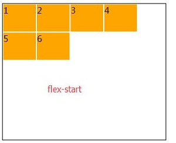 &emsp;&emsp;
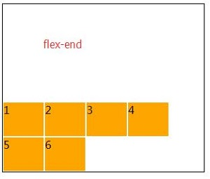 
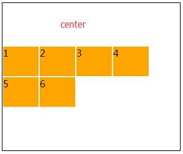 &emsp;&emsp;
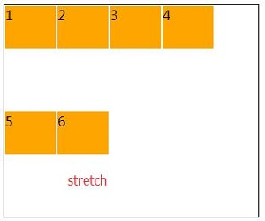 
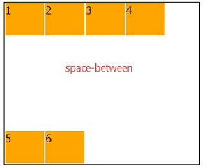 &emsp;&emsp;
 

### 一：子元素属性
    子元素的属性有六种：
- order ：定义项目的排列顺序。数值越小，排列越靠前，默认为0。
- flex-grow ： 定义项目的放大比例，默认为0，即如果存在剩余空间，也不放大。
- flex-shrink ：定义了项目的缩小比例，默认为1，即如果空间不足，该项目将缩小。
- flex-basis ： 定义了在分配多余空间之前，项目占据的主轴空间（main size）
- flex ： 是flex-grow, flex-shrink 和 flex-basis的简写，默认值为0 1 auto。后两个属性可选。
- align-self ： 允许单个项目有与其他项目不一样的对齐方式，可覆盖align-items属性。默认值为auto，表示继承父元素的align-items属性，如果没有父元素，则等同于stretch。

### 1. order属性
&emsp;&emsp;定义项目的排列顺序，数值越小排列越靠前，默认为0
```
    #container{
        display: flex;
        flex-direction: row;
        width:300px;
        height:100px;
        border: 1px solid #000;
    }
    .inner{
        width:60px;
            height:50px; 
        background:orange;
        border:1px solid #fff;
    }
    .item{
        order : -1;
    }
```
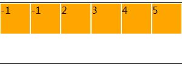

### 2. flex-grow属性
&emsp;&emsp;定义项目的放大比例，默认为0，即如果存在剩余空间，也不放大
```
    <style>
        #container{
            display: flex;
            flex-direction: row;
            width:500px;
            height:100px;
            border: 1px solid #000;
        }
        .inner{
            width:60px;
            height:50px; 
            background:orange;
            border:1px solid #fff;
        }
        .grow0{
            flex-grow : 0;
        } 
        .grow1{
            flex-grow : 1;
        }        
        .grow2{
            flex-grow : 2;
        }
    </style>
    <div id="container">
        <div class="inner grow1">1</div>
        <div class="inner grow2">2</div>
        <div class="inner grow0">3</div>
        <div class="inner">4</div>
        <div class="inner">5</div>
        <div class="inner">6</div>
    </div>
```

如果所有项目的flex-grow属性都为1，则它们将等分剩余空间（如果有的话）。如果一个项目的flex-grow属性为2，其他项目都为1，则前者占据的剩余空间,总之，设置固定的px之后，其他设置flex-grow的平分剩余的空间。
### 3.flex-shrink属性
&emsp;&emsp;定义了项目的缩小比例，默认为1，即如果空间不足，该项目将缩小。
```
    <style>
        #container{
            display: flex;
            flex-direction: row;
            width:500px;
            height:100px;
            border: 1px solid #000;
        }
        .inner{
            width:200px;
            height:50px; 
            background:orange;
            border:1px solid #fff;
        }
        .shrink0{
            flex-shrink : 0;
        }        
        .shrink1{
            flex-shrink : 1;
        } 
    </style> 
    <div id="container">
        <div class="inner shrink0">1</div>
        <div class="inner shrink1">2</div>
        <div class="inner ">3</div>
        <div class="inner">4</div>
        <div class="inner">5</div>
        <div class="inner">6</div>
    </div>
```

如上图所示，所有子元素都为200px，明显超过了所定义的父容器大小，但是设置`flex-direction: row;`的时候，每个元素都默认平均非配空间，当flex-shrink为0的时候，元素就不会缩小。

### 4.flex-basis
&emsp;&emsp;定义了在分配多余空间之前，项目占据的主轴空间（main size）,浏览器根据这个属性，计算主轴是否有多余空间。它的默认值为auto，即项目的本来大小。
```
    #container{
        display: flex;
        width:300px;
        height:100px;
        border: 1px solid #000;
    }
    .inner{
        width:100px;
        height:50px; 
        background:orange;
        border:1px solid #fff;
    }
    .basis{
        flex-basis:200px; 
    }
```
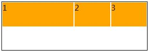

### 5.flex属性
&emsp;&emsp;flex属性是flex-grow,flex-shrink和flex-basie的简写，默认值为0 1 auto。建议优先使用这个属性，而不是单独写三个分离的属性，因为浏览器会推算相关值。

### 6.align-self属性
&emsp;&emsp;align-self属性允许单个项目有与其他项目不同的对齐方式，可以覆盖align-items属性。默认为auto，表示继承父元素的align-items属性，如果没有父元素，等同于stretch。该属性可能取6个值，除了auto，其他都与align-items属性完全一致。
```
    #container{
        display: flex;
        width:300px;
        height:200px;
        border: 1px solid #000;
        align-items: flex-start;
    }
    .inner{
        width:100px;
        height:50px; 
        background:orange;
        border:1px solid #fff;
    }
    .item{
            /* align-self: auto | flex-start | flex-end | center | baseline | stretch; */
            height:100px;
            align-self : flex-end;
    }
```
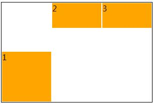